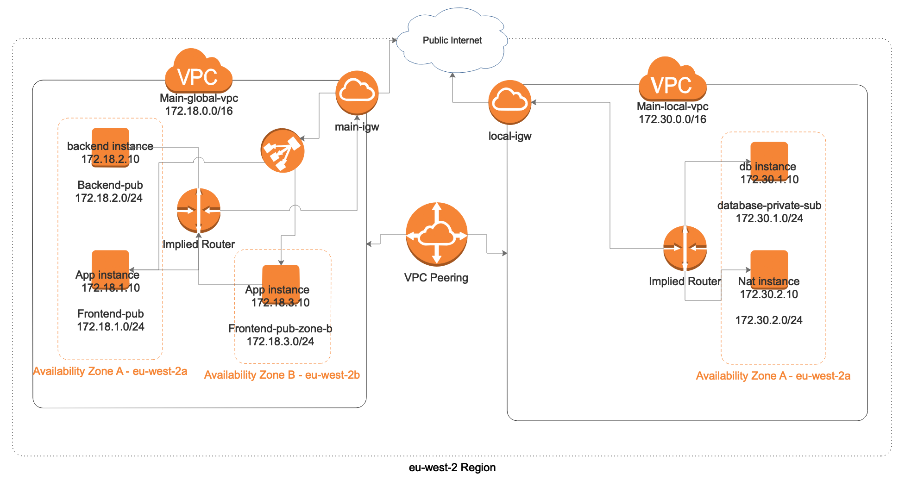
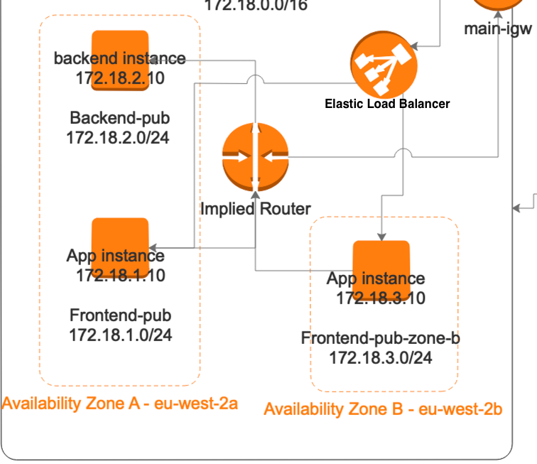

# Learning DevOps  - AWS-VPC With Terraform

###### :page_facing_up: AWS-VPC With Terraform

AWS-VPC With Terraform project.

Set up a custom Network to Deploy a 3-tier Application.

In this project, we will deploy a Django API Backend, A React Frontend Webapp and A Postgresql db. \
The Frontend and API Backend will be hosted in the public subnet, the Database will be hosted in a Private subnet. \
An Application Load Balancer will be configured to access our Frontend Application

## Description of the Process and Steps to Deploy this Project



---
#### Screencast
Check later for a recorded screencast showing how to create a custom Network to Deploy a 3-tier App.

---

#### Setup

From our Network Architecture Diagram, we will create 2 VPCs (Virtual Private Cloud) within the same region (eu-west-2), and configure VPC Peering to enable you route traffic between VPCs using private addresses.

A VPC is a logical division of a service provider’s public cloud multi-tenant architecture to support private cloud computing.

Below is the description of the VPCs created.

1. Main-global-vpc  
`Main-global-vpc` with `primary CIDR Block 172.18.0.0/16`

When you create a VPC, you specify a range of IPv4 addresses for the VPC in the form of a Classless Inter-Domain Routing (CIDR) block.\
A VPC spans all the Availability Zones in the region, and you can add one or more subnets in each availability zone.\
If the subnet’s traffic is routed to an internet gateway, the subnet is known as a `public subnet`.\
If a subnet doesn’t have a route to the internet gateway, the subnet is known as a `private subnet`.

`Public Subnets` created in `Main-global-vpc`\
`Frontend-pub` with `CIDR Block 172.18.1.0/24`, configured in Availability Zone A -  The web app (React Frontend) will be hosted here.

`Backend-pub` with `CIDR Block 172.18.2.0/24`, configured in Availability Zone A - The api backend (Django Backend) will be hosted here.

`Frontend-pub-zone-b` with `CIDR Block 172.18.3.0/24`, configured in Availability Zone B - The web app (React Frontend) will be hosted here too. By launching the web app instances in separate Availability Zones, you can protect your application from the failure of a single location.

An application Load Balancer will be configured to access the frontend application, and web app instances from those different availability Zones will be registered as targets for the load balancer.

2. Main-local-vpc\
`Main-local-vpc` with `primary CIDR Block 172.30.0.0/16`

`Private Subnet` created in `Main-local-vpc`\
`Database-private-sub` with `CIDR Block 172.30.1.0/24`, configured in Availability zone A - A database instance running postgresql db will be hosted here

`Public Subnet` created in Main-local-vpc
`Nat-pub` with `CIDR Block 172.30.2.0/24`, configured in Availability zone A - A Nat Instance that will act as a jump host will hosted here

##### Using Terraform to script our Network configuration.
After planning our Network Architecture, we will use Terraform to script our Network configuration.\
Using Terraform we will be able to create an immutable infrastructure which provides a level of control and testability to maintain a healthy and stable environment for all components that never deviate from a source definition. 

---

#### Guidelines To Create our Custom Network using Terraform

To create our custom network,  we will use the terraform scripts

1. Clone the repository and `cd` into `AWS-VPC-Terraform`
```
git clone https://github.com/sekayasin/AWS-VPC-Terraform.git
cd AWS-VPC-Terraform
```
2. Terraform package must be installed, You can install it using `homebrew` on a mac
```
brew install terraform
```
3. It's important to specify the `AWS secret` and `access keys`. Create and add a `terraform.tfvars` file and add your AWS ACCESS_KEY and SECRET_KEY, make sure you gitignore this file to avoid any security issues that might rise when your forget and commit your AWS secret keys to Github which makes your keys exposed.\
`terraform.tfvars` will populate the variables in the `vars.tf` file when the terraform script is executed.    
```
ACCESS_KEY = "SDBJBGJFSKHVSNCXKANDKSBK"
SECRET_KEY = "tejdbkndscRSDHBSDcsgfajh1797jsdgcSAGFDSFHJSDHSH"
REGION = "eu-west-2"
PRIVATE_KEY = "your-key"
PUBLIC_KEY = "your-key.pub"
```
Yes, Generate an RSA key using `ssh-keygen commandline utility` to be used by SSH protocol when you wish to remotely login to the instances you have spinned up. `ssh-keygen utility` will create a private key and public key which you will use for remote access. create the keys by running `ssh-keygen command line utility`. `key.tf` terraform file will upload your public key to all your instances created, and use your private key to for remote access.
```
$ ssh-keygen -f your-key
Run that command in your terminal - It will create a key pair i.e your-key which is your private key and your-key.pub which is your public key
```
4. For terraform to create the instances you wish to spin up, you can use packer to build your own AMI images and provide them to terraform.

##### How to use Packer and Ansible to build your own Images required for Deployment
Checkout this [repo](https://github.com/sekayasin/Packer-Ansible) on how to use Packer to build your own images.

Notice the `bake-images` folder, this folder consists of our packer templates in json that will build our Images for the API, Frontend APP and Database together with their Ansible Scripts in yml as named respectively `api_ami.json and api.yml`, `app_ami.json and app.yml`, and `db_ami.json and db.yml` 

```
cd bake-iamges
./bake.sh - This will create AMI Images for your customized instances, Use the AMI created to spin up the Database, API Backend , and the Frontend 
```
5. Run the `terraform init`, then optionally you can run `terraform plan` to check whether the execution plan for a set of changes matches your expectations and finally run `terraform apply` command, this will create the following resources on AWS
- Two VPCs with public and private subnets
- A VPC Peering to Route Traffic within different VPCs
- An Application Load Balancer to access our frontend application
- A Database instance running postgresql in a private Subnet with private IP: 172.30.1.10
- A frontend application in eu-west-2a availability zone with a private IP: 172.18.1.10
- A frontend application in eu-west-2b availability zone with a private IP: 172.18.3.10
- A Nat instance to act as a jump host with a Private IP: 172.30.2.10
- A Backend API instance with a Private IP: 172.18.2.10 - this will communicate with the Database instance 
- Internet gateway for connecting to the internet

#### Creating an Elastic Load Balancer (ELB)
Yes, the terraform script will create a load balancer. Elastic Load Balancing automatically distributes incoming application traffic across multiple targets, such as EC2 instances, containers, and IP addresses in multiple Availability Zones. It can handle the varrying load of your application traffic in a single Availability Zone or across multiple Availability Zones. This makes your application highly available.

There are three types of Load Balancer namely;
1. Application Load Balancer - Is best suited for load balancing of HTTP and HTTPS Traffic and provides advanced routing targeted at the delivery of modern application architectures, including microservices and containers. Operates at Layer 7 (Application Layer of the OSI Model).
2. Network Load Balancer - Is best suited for load balancing of Transmission Control Protocol (TCP) and Transport Layer Security (TLS) traffic where extreme performance is required. Operates at Layer 4 (Transport Layer of the OSI Model).
3. Classic Load Balancer - provides basic load balancing across multiple Amazon EC2 instances and operates at both the request level (Layer 7) and connection level (Layer 4). Classic Load Balancer is intended for applications that were built within the EC2-Classic network.

For our custom Network, Our Terraform script will create an Application Load Balancer

Here is an extract of the infrastructure diagram showing the load balancer configured to distribute traffic for our frontend apps in Zone A and B.\
\
It uses health checks to detect which instances are healthy and directs traffic only across those instances

Check out `elb.tf` terraform file, It creates an application load Balancer named `webapp-lb`\
Once the Terraform has successful created our custom network. To get the Load Balancer Link, kindly log on to AWS console, `Click on Load Balancers > Description > DNS name: webapp-lb-422337339.eu-west-2.elb.amazonaws.com` - This Link is our configured Load Balancer.

Configured Load Balancer for the Frontend app: http://webapp-lb-422337339.eu-west-2.elb.amazonaws.com/

NOTE: If the Load Balancer Link up is not working, It's Likely that the resources created by our Terraform script have been destroyed by the time you've checked this repo to avoid incurring high bills on AWS.

---

#### Tools used
1. Terraform - To script our custom network configuration
2. AWS   -   Amazon Web Services is a subsidiary of Amazon that provides on-demand cloud computing platforms to individuals, companies, and governments, on a paid subscription basis.
3. Amazon EC2  - Amazon Elastic Compute Cloud (Amazon EC2) is a web service that provides resizable compute capacity in the cloud. 
4. AWS Elastic Load Balancer - An Application load balancer to access the frontend application
<!-- 5. Amazon Route 53 - Route 53 is a scalable and highly available Domain Name System (DNS) service.  -->
<!-- 6. Freenom -  Freenom is the world’s first and only free domain provider - I used freenom to register my domain name. -->
   
---

###### :microscope: NOTE
---
